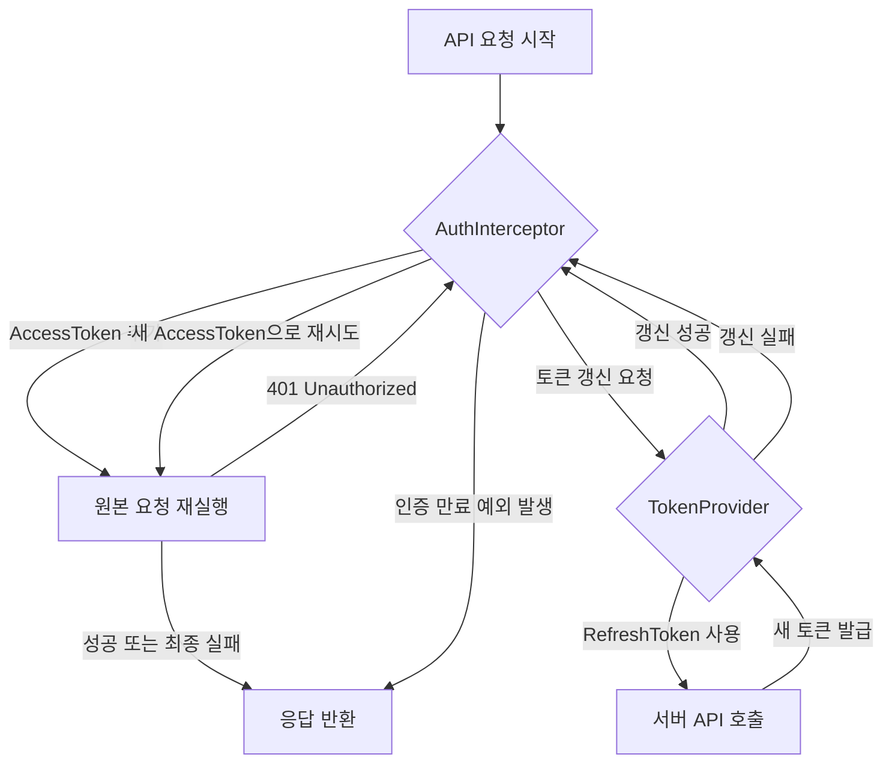

# 인증 토큰 Refresh 로직 상세 가이드

WalkIt 앱의 인증 토큰 Refresh 로직은 OkHttp Interceptor 패턴과 Kotlin Coroutines를 활용하여 401 Unauthorized 에러 발생 시 토큰을 안전하고 효율적으로 갱신하도록 설계되었습니다. 이 문서는 주요 구성 요소와 동작 방식을 설명합니다.

## 1. Refresh Flow 개요

앱에서 서버로 API 요청을 보낼 때 다음과 같은 흐름으로 인증 토큰 갱신이 이루어집니다.

1.  **AccessToken 추가**: `AuthInterceptor`가 모든 아웃고잉(outgoing) 요청에 현재 유효한 `AccessToken`을 `Authorization` 헤더로 추가합니다.
2.  **401 에러 감지**: 서버가 `AccessToken` 만료 등의 이유로 `401 Unauthorized` 응답을 반환하면, `AuthInterceptor`가 이를 감지합니다.
3.  **토큰 갱신 요청**: `AuthInterceptor`는 `TokenProvider`에게 토큰 갱신을 요청합니다.
4.  **RefreshToken 사용**: `TokenProvider`는 저장된 `RefreshToken`을 사용하여 서버에 새 `AccessToken`과 `RefreshToken`을 요청(API 호출)합니다.
5.  **요청 재시도**: 토큰 갱신에 성공하면, `AuthInterceptor`는 새로 발급받은 `AccessToken`으로 원래 `401` 에러를 받았던 요청을 재시도합니다.
6.  **동시성 제어**: 이 모든 과정은 여러 동시 요청이 발생하더라도 하나의 토큰 갱신 작업만 수행되도록 정교한 동시성 제어가 적용됩니다.



---

## 2. 주요 구성 요소

### 2.1. `AuthInterceptor.kt`

`AuthInterceptor`는 OkHttp 네트워크 요청을 가로채어 인증 헤더를 추가하고, `401 Unauthorized` 응답을 감지하여 토큰 갱신 프로세스를 시작하는 역할을 합니다.

**코드 (`app/src/main/java/swyp/team/walkit/data/remote/interceptor/AuthInterceptor.kt`)**

```kotlin
@Singleton
class AuthInterceptor @Inject constructor(
    private val tokenProvider: TokenProvider,
    @Named("walkit") private val retrofitProvider: Provider<Retrofit>,
) : Interceptor {

    private val interceptorMutex = kotlinx.coroutines.sync.Mutex()

    override fun intercept(chain: Interceptor.Chain): Response {
        val originalRequest = chain.request()
        var request = originalRequest

        // 1. 요청에 AccessToken 헤더 추가
        val accessToken = tokenProvider.getAccessToken()
        if (!accessToken.isNullOrBlank()) {
            request = originalRequest.newBuilder()
                .header("Authorization", "Bearer $accessToken")
                .build()
        }

        val response = chain.proceed(request)

        // 2. 401 Unauthorized 응답 감지 시 토큰 갱신 시도
        if (response.code == 401) {
            interceptorMutex.withLock { // AuthInterceptor 레벨 동시성 제어
                val authApi = retrofitProvider.get().create(AuthApi::class.java) // AuthInterceptor가 적용되지 않은 순수 AuthApi
                val refreshSuccess = tokenProvider.refreshTokensOn401(authApi)

                if (refreshSuccess) {
                    val newAccessToken = tokenProvider.getAccessToken()
                    if (newAccessToken.isNullOrBlank()) {
                        throw AuthExpiredException("Token refresh succeeded but no access token available")
                    }
                    // 3. 새 AccessToken으로 원래 요청 재시도
                    val retryRequest = originalRequest.newBuilder()
                        .header("Authorization", "Bearer $newAccessToken")
                        .build()
                    val retryResponse = chain.proceed(retryRequest)

                    // 4. 재시도했는데 또 401이면 인증 만료 처리
                    if (retryResponse.code == 401) {
                        throw AuthExpiredException("Authentication expired - request still fails after token refresh")
                    }
                    return retryResponse
                } else {
                    throw AuthExpiredException("Token refresh failed: authentication expired")
                }
            }
        }
        return response
    }
}
```

**주요 역할 및 동작:**

*   **`intercept(chain: Interceptor.Chain): Response`**: 모든 네트워크 요청마다 호출되어 요청을 가로챕니다.
*   **`Authorization` 헤더 추가**: `tokenProvider.getAccessToken()`을 통해 현재 `AccessToken`을 가져와 `Authorization: Bearer <AccessToken>` 형식으로 요청 헤더에 추가합니다.
*   **`401` 감지**: 서버 응답 코드가 `401`일 경우 토큰 갱신 로직을 시작합니다.
*   **`interceptorMutex`**: 여러 API 요청이 거의 동시에 `401` 에러를 받았을 때, `interceptorMutex`는 `AuthInterceptor` 내에서 단 하나의 스레드만 토큰 갱신 로직을 수행하도록 보장합니다. 이는 불필요한 중복 갱신 시도를 막고, `TokenProvider`의 동시성 제어와 시너지를 냅니다.
*   **`tokenProvider.refreshTokensOn401(authApi)` 호출**: 실제 토큰 갱신 작업을 `TokenProvider`에게 위임합니다. 이때 전달되는 `authApi` 인스턴스는 **반드시 `AuthInterceptor`가 적용되지 않은 순수한 Retrofit 인스턴스에서 생성된 것이어야 합니다.** 그렇지 않으면 토큰 갱신 요청 자체가 `401`을 받아 무한 루프에 빠질 수 있습니다.
*   **요청 재시도**: 토큰 갱신에 성공하면, 새 `AccessToken`으로 `originalRequest`를 다시 빌드하여 `chain.proceed(retryRequest)`를 통해 요청을 재시도합니다.
*   **`AuthExpiredException`**: 토큰 갱신에 실패하거나, 갱신 후 재시도한 요청마저 `401`을 받으면 `AuthExpiredException`을 발생시킵니다. 이 예외는 앱의 상위 레이어에서 처리되어 사용자 로그아웃 및 로그인 화면으로의 이동을 유도해야 합니다.

---

### 2.2. `TokenProvider.kt`

`TokenProviderImpl`은 `AccessToken`과 `RefreshToken`을 관리하고 제공하며, 특히 `401` 응답 시 `RefreshToken`을 사용하여 새 토큰을 받아오는 핵심 로직을 담당합니다. 메모리 캐싱, 영구 저장소 연동, 그리고 복잡한 동시성 및 상태 관리가 이루어집니다.

**코드 (`app/src/main/java/swyp/team/walkit/data/remote/auth/TokenProvider.kt`)**

```kotlin
@Singleton
class TokenProviderImpl @Inject constructor(
    private val authDataStore: AuthDataStore, // 토큰을 DataStore에 영구 저장/로드
    @Named("walkit") private val retrofitProvider: Provider<Retrofit>, // AuthInterceptor가 적용되지 않은 Retrofit 인스턴스
) : TokenProvider {

    private val _cachedAccessToken = MutableStateFlow<String?>(null)
    private val _cachedRefreshToken = MutableStateFlow<String?>(null)

    private var lastRefreshSuccessTime = 0L
    private var lastRefreshFailureTime = 0L
    private val REFRESH_FAILURE_COOLDOWN_MS = 10000L // 10초 쿨다운

    // 단일 refresh 보장을 위한 상태 관리
    private val singleRefreshMutex = Mutex()
    private var currentRefreshJob: CompletableDeferred<Boolean>? = null
    private var refreshTokenConsumed = false // Refresh Token이 이미 사용되었는지 추적

    private val scope = CoroutineScope(SupervisorJob() + Dispatchers.IO)

    init {
        // DataStore에서 토큰을 읽어와 메모리 캐시를 업데이트
        scope.launch { authDataStore.accessToken.collect { token -> _cachedAccessToken.value = token } }
        scope.launch { authDataStore.refreshToken.collect { token -> _cachedRefreshToken.value = token } }
    }

    override suspend fun refreshTokensOn401(authApi: AuthApi): Boolean {
        return singleRefreshMutex.withLock { // 앱 전체에서 단 하나의 refresh token API 호출만 수행
            val currentTime = System.currentTimeMillis()

            // 1️⃣ 이미 진행 중인 refresh가 있는 경우 결과 대기
            currentRefreshJob?.let { job ->
                return withTimeoutOrNull(15000) { job.await() } ?: false
            }

            // 2️⃣ refresh token이 이미 소비되었는지 확인 (서버 정책상 중요)
            if (refreshTokenConsumed) {
                return false
            }

            // 3️⃣ 최근 성공 후 보호 기간인지 확인 (5초 내 재요청 방지)
            if (currentTime - lastRefreshSuccessTime < 5000) {
                return true // 이미 유효한 토큰이 있다고 간주
            }

            // 4️⃣ 쿨다운 기간 확인 (이전 실패 후 10초 동안 재시도 방지)
            if (currentTime - lastRefreshFailureTime < REFRESH_FAILURE_COOLDOWN_MS) {
                return false
            }

            // 5️⃣ 새로운 refresh 작업 시작
            val refreshJob = CompletableDeferred<Boolean>()
            currentRefreshJob = refreshJob

            try {
                val refreshToken = getRefreshToken()
                if (refreshToken.isNullOrBlank()) {
                    refreshJob.complete(false)
                    return false
                }
                refreshTokenConsumed = true // refresh token 사용 표시

                // 6. Refresh Token API 호출
                val refreshRequest = RefreshTokenRequest(refreshToken)
                val response = authApi.refreshToken(refreshRequest)

                if (response.isSuccessful) {
                    val newTokens = response.body()
                    if (newTokens?.accessToken?.isNotBlank() == true) {
                        // 7. 새 토큰 저장 및 상태 업데이트
                        updateTokens(newTokens.accessToken, newTokens.refreshToken)
                        lastRefreshSuccessTime = System.currentTimeMillis()
                        lastRefreshFailureTime = 0L

                        // 새로운 refresh token을 받았으면 소비 상태 리셋
                        if (newTokens.refreshToken?.isNotBlank() == true) {
                            refreshTokenConsumed = false
                        }
                        refreshJob.complete(true)
                        return true
                    }
                }
                // 8. 갱신 실패 처리
                lastRefreshFailureTime = System.currentTimeMillis()
                clearTokens() // 실패 시 모든 토큰 제거
                refreshJob.complete(false)
                return false

            } catch (e: Exception) {
                // 9. 예외 발생 시 처리
                lastRefreshFailureTime = System.currentTimeMillis()
                clearTokens() // 예외 발생 시 모든 토큰 제거
                refreshJob.complete(false)
                return false
            } finally {
                currentRefreshJob = null // 작업 완료 후 currentRefreshJob 초기화
            }
        }
    }

    override fun isRefreshTokenValid(): Boolean {
        val currentTime = System.currentTimeMillis()
        // 최근 실패 후 쿨다운 기간 중이라면 유효하지 않다고 판단
        if (currentTime - lastRefreshFailureTime < REFRESH_FAILURE_COOLDOWN_MS) {
            return false
        }
        return true
    }
    // ... (그 외 토큰 저장/로드 및 캐시 관련 메서드) ...
}
```

**주요 역할 및 동작:**

*   **`@Singleton` 및 의존성 주입**: `TokenProviderImpl`은 앱 전체에 걸쳐 단일 인스턴스만 존재하며, `AuthDataStore` (토큰 영구 저장)와 `retrofitProvider` (API 호출)를 주입받습니다.
*   **메모리 캐시 및 `StateFlow`**: `_cachedAccessToken`과 `_cachedRefreshToken`은 메모리에 현재 토큰을 캐시하고 `MutableStateFlow`를 통해 토큰 변경 사항을 비동기적으로 관찰할 수 있도록 합니다. `init` 블록에서 `AuthDataStore`의 변경을 구독하여 캐시를 항상 최신 상태로 유지합니다.
*   **`singleRefreshMutex`**: `TokenProvider`의 `refreshTokensOn401` 메서드 내에서 작동하며, **실제 토큰 갱신 API 호출이 앱 전체에서 오직 한 번만 이루어지도록 보장합니다.** 이는 서버의 `RefreshToken` 정책(예: 한 번 사용 시 무효화)에 매우 중요합니다.
*   **`currentRefreshJob: CompletableDeferred<Boolean>?`**: 여러 코루틴이 거의 동시에 토큰 갱신을 요청할 때, 이미 진행 중인 갱신 작업이 있으면 새로운 갱신을 시작하지 않고 기존 작업의 결과를 기다립니다. `withTimeoutOrNull`로 무한 대기를 방지합니다.
*   **`refreshTokenConsumed`**: `RefreshToken`이 서버 정책상 한 번 사용되면 무효화되는 경우를 대비한 플래그입니다. `authApi.refreshToken` 호출 전에 `true`로 설정하고, 서버로부터 **새로운** `RefreshToken`을 성공적으로 받으면 다시 `false`로 리셋합니다.
*   **쿨다운 및 보호 기간**:
    *   **`REFRESH_FAILURE_COOLDOWN_MS` (10초)**: 토큰 갱신 실패 후 10초 동안은 추가적인 갱신 시도를 막아 서버 부하를 줄입니다.
    *   **`lastRefreshSuccessTime` (5초 보호)**: 최근에 갱신이 성공했다면 5초 동안은 불필요한 재갱신 시도를 막습니다.
*   **`authApi.refreshToken(refreshRequest)`**: 실제 `RefreshToken`을 서버로 보내 새 `AccessToken` 및 `RefreshToken`을 요청하는 API 호출입니다.
*   **토큰 업데이트 및 클리어**: 갱신 성공 시 `updateTokens`를 통해 새 토큰을 `AuthDataStore`에 저장하고, 실패 시 `clearTokens()`를 호출하여 모든 토큰을 제거함으로써 사용자 로그아웃을 유도합니다.

---

## 3. 로직의 견고성

이 프로젝트의 인증 토큰 refresh 로직은 다음과 같은 측면에서 매우 견고하게 구현되었습니다.

*   **다중 계층 동시성 제어**: `AuthInterceptor`의 `interceptorMutex`와 `TokenProvider`의 `singleRefreshMutex`, 그리고 `currentRefreshJob`을 통한 대기 메커니즘은 복잡한 동시성 문제를 매우 효과적으로 처리하여 여러 API 요청이 동시에 `401`을 반환하는 상황에서도 앱이 안정적으로 동작하도록 합니다.
*   **Single-Use Refresh Token 지원**: `refreshTokenConsumed` 플래그는 서버가 `RefreshToken`을 한 번만 사용하도록 허용하는 경우에 매우 중요하며, 이를 통해 불필요하거나 실패할 수 있는 중복 갱신 시도를 방지합니다.
*   **적극적인 오류 처리**: 갱신 실패 시 토큰을 제거하고 쿨다운 기간을 두는 것은 앱의 안정성을 높이고 서버에 대한 부하를 줄입니다.
*   **분리된 `AuthApi` 인스턴스**: `AuthInterceptor`가 적용되지 않은 `AuthApi` 인스턴스를 사용하여 순환 의존성을 방지하는 방식은 매우 중요하며 올바른 설계입니다.

이러한 설계는 OkHttp Interceptor 패턴과 코루틴(Mutex, CompletableDeferred)을 활용하여 다수의 동시 요청, `RefreshToken`의 일회성 사용 등 복잡한 시나리오를 효과적으로 처리하도록 설계되어 있습니다.
