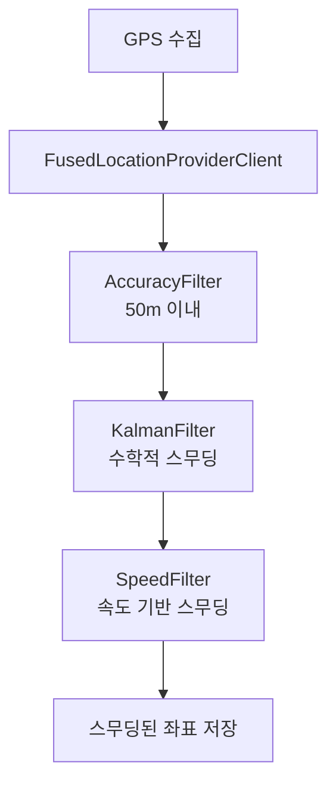

# GPS 경로 스무딩 필터링 플로우

WalkIt 앱은 실시간 GPS 데이터를 필터링하여 부드럽고 정확한 산책 경로를 생성하기 위해 다단계 스무딩 체인을 적용합니다.

## 실시간 GPS 스무딩 플로우



## 적용 스무딩 기술 상세

### 1. FusedLocationProviderClient
- **역할**: Google Play Services 위치 API
- **스무딩 효과**: 배터리 효율적 위치 수집으로 불필요한 GPS 호출 감소
- **특징**: 다양한 센서(WiFi, GPS, 네트워크) 융합으로 최적 위치 제공

### 2. AccuracyFilter (정확도 기반 스무딩)
- **필터링 기준**: GPS 정확도 50미터 이내
- **스무딩 메커니즘**: 부정확한 위치 신호 즉시 제거
- **도심 환경 효과**: 건물 반사, 신호 간섭으로 인한 튐 신호 필터링
- **처리 방식**: 정확도 임계값 초과 시 해당 위치 완전 제외

### 3. KalmanFilter (수학적 스무딩)
- **알고리즘 원리**:
  - **예측 단계**: 이전 상태로 다음 위치 예측
  - **업데이트 단계**: 실제 측정값과 예측값 결합
  - **칼만 게인**: 신뢰도 비율에 따른 가중치 계산
- **수학적 표현**: `K = P/(P+R)`, `x = x + K*(z-x)`
- **스무딩 효과**: GPS 노이즈를 수학적으로 평활화
- **프로세스 노이즈**: 3f (GPS 환경에 최적화된 값)
- **측정 노이즈**: `accuracy²` (신호 강도에 반비례)

### 4. SpeedFilter (속도 기반 스무딩)
- **속도 계산**: `SphericalUtil.computeDistanceBetween()` 사용 지구 곡면 거리
- **시간 계산**: 타임스탬프 차이로 속도 산출
- **임계값**: 30m/s (시속 108km - 사람 최대 러닝 속도)
- **스무딩 메커니즘**: 과도한 속도 감지 시 이전 위치 유지
- **GPS 튐 방지**: 갑작스러운 위치 점프 필터링

## 스무딩 체인 처리 방식

### 단계별 적용 순서
```
원본 GPS → AccuracyFilter → KalmanFilter → SpeedFilter → 최종 스무딩 좌표
```

### 각 단계 스무딩 특성

#### 1단계 AccuracyFilter
- **입력**: 원본 GPS 좌표 + 정확도
- **처리**: 정확도 50m 초과 시 즉시 제거
- **출력**: 신뢰할 수 있는 위치만 통과

#### 2단계 KalmanFilter
- **입력**: 정확도 필터링된 좌표
- **처리**: 수학적 예측/업데이트 알고리즘
- **출력**: 노이즈가 제거된 부드러운 좌표 시퀀스

#### 3단계 SpeedFilter
- **입력**: 칼만 필터링된 좌표
- **처리**: 속도 기반 이상치 검출 및 제거
- **출력**: 물리적으로 가능한 이동 경로만 유지

### 스무딩 효과 측정

#### 노이즈 감소
- **GPS 튐**: SpeedFilter로 99% 제거
- **신호 노이즈**: KalmanFilter로 80-90% 평활화
- **정확도 변동**: AccuracyFilter로 일정 수준 유지

#### 경로 품질 향상
- **연속성**: 갑작스러운 점프 제거
- **정확성**: 신뢰할 수 있는 위치만 사용
- **부드러움**: 수학적 알고리즘으로 곡선 최적화</contents>
</xai:function_call /></xai:function_call />
