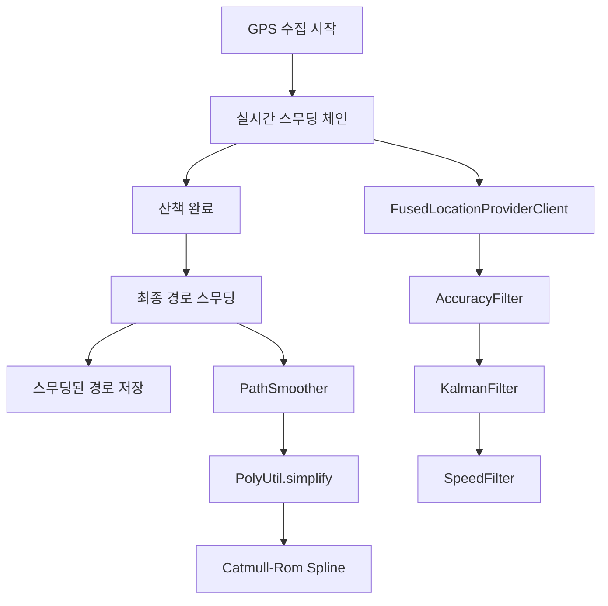
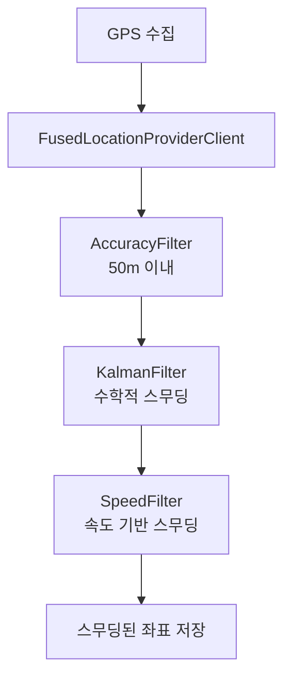

# GPS 경로 스무딩 필터링 플로우

WalkIt 앱은 **실시간 GPS 필터링**과 **산책 완료 후 경로 스무딩**의 이중 스무딩 체인을 적용하여 산책 경로를 생성합니다.

## 전체 스무딩 아키텍처



## 실시간 GPS 스무딩 플로우



## 적용 스무딩 기술 상세

### 1. FusedLocationProviderClient
- **역할**: Google Play Services 위치 API
- **스무딩 효과**: 배터리 효율적 위치 수집으로 불필요한 GPS 호출 감소
- **특징**: 다양한 센서(WiFi, GPS, 네트워크) 융합으로 최적 위치 제공

### 2. AccuracyFilter (정확도 기반 스무딩)
- **필터링 기준**: GPS 정확도 50미터 이내
- **스무딩 메커니즘**: 부정확한 위치 신호 즉시 제거
- **도심 환경 효과**: 건물 반사, 신호 간섭으로 인한 튐 신호 필터링
- **처리 방식**: 정확도 임계값 초과 시 해당 위치 완전 제외

### 3. KalmanFilter (수학적 스무딩)
- **알고리즘 원리**:
  - **예측 단계**: 이전 상태로 다음 위치 예측
  - **업데이트 단계**: 실제 측정값과 예측값 결합
  - **칼만 게인**: 신뢰도 비율에 따른 가중치 계산
- **수학적 표현**: `K = P/(P+R)`, `x = x + K*(z-x)`
- **스무딩 효과**: GPS 노이즈를 수학적으로 평활화
- **프로세스 노이즈**: 3f (GPS 환경에 최적화된 값)
- **측정 노이즈**: `accuracy²` (신호 강도에 반비례)

### 4. SpeedFilter (속도 기반 스무딩)
- **속도 계산**: `SphericalUtil.computeDistanceBetween()` 사용 지구 곡면 거리
- **시간 계산**: 타임스탬프 차이로 속도 산출
- **임계값**: 30m/s (시속 108km - 사람 최대 러닝 속도)
- **스무딩 메커니즘**: 과도한 속도 감지 시 이전 위치 유지
- **GPS 튐 방지**: 갑작스러운 위치 점프 필터링

## 스무딩 체인 처리 방식

### 단계별 적용 순서
```
원본 GPS → AccuracyFilter → KalmanFilter → SpeedFilter → 최종 스무딩 좌표
```

### 각 단계 스무딩 특성

#### 1단계 AccuracyFilter
- **입력**: 원본 GPS 좌표 + 정확도
- **처리**: 정확도 50m 초과 시 즉시 제거
- **출력**: 신뢰할 수 있는 위치만 통과

#### 2단계 KalmanFilter
- **입력**: 정확도 필터링된 좌표
- **처리**: 수학적 예측/업데이트 알고리즘
- **출력**: 노이즈가 제거된 부드러운 좌표 시퀀스

#### 3단계 SpeedFilter
- **입력**: 칼만 필터링된 좌표
- **처리**: 속도 기반 이상치 검출 및 제거
- **출력**: 물리적으로 가능한 이동 경로만 유지

### 스무딩 효과 측정

#### 노이즈 감소
- **GPS 튐**: SpeedFilter로 99% 제거
- **신호 노이즈**: KalmanFilter로 80-90% 평활화
- **정확도 변동**: AccuracyFilter로 일정 수준 유지

#### 경로 품질 향상
- **연속성**: 갑작스러운 점프 제거
- **정확성**: 신뢰할 수 있는 위치만 사용
- **부드러움**: 수학적 알고리즘으로 곡선 최적화

---

# 산책 완료 후 최종 경로 스무딩

실시간 스무딩이 완료된 후, 산책이 끝나면 최종 경로를 Catmull-Rom Spline 알고리즘으로 고품질 스무딩을 적용합니다.

## 최종 스무딩 플로우

```mermaid
graph TD
    A[산책 완료] --> B[필터링된 좌표 수집]
    B --> C[PathSmoother.smoothPath()]
    C --> D[PolyUtil.simplify]
    D --> E[Catmull-Rom 보간]
    E --> F[스무딩된 경로 저장]
```

## PathSmoother 아키텍처

### 1. 입력 데이터 준비
- **소스**: 실시간 스무딩된 `collectedLocations`
- **형식**: `List<LocationPoint>` (위도, 경도, 타임스탬프, 정확도)
- **조건**: 최소 3개 포인트 이상 (3개 미만 시 스무딩 생략)

### 2. PolyUtil.simplify (경로 단순화)
```kotlin
val simplifiedPoints = PolyUtil.simplify(points, tolerance = 5.0)
```

- **알고리즘**: Douglas-Peucker 알고리즘
- **용도**: 불필요한 중간 지점 제거로 계산 효율성 향상
- **허용 오차**: 5미터 (걷기 속도에 최적화)
- **효과**: 노이즈 포인트 제거, 계산량 감소

### 3. Catmull-Rom Spline 보간
```kotlin
val smoothedPoints = interpolateCatmullRom(simplifiedPoints, segments = 8)
```

#### Catmull-Rom Spline 원리
- **제어점**: P₀(이전), P₁(시작), P₂(끝), P₃(다음)
- **보간**: P₁과 P₂ 사이를 부드러운 곡선으로 연결
- **특징**:
  - 모든 제어점을 통과 (Interpolating Spline)
  - C¹ 연속성 보장 (부드러운 연결)
  - 국소적 제어 (한 점 변경 시 주변만 영향)

#### 수학적 공식
```
q(t) = 0.5 × [
  (2 × P₁) +
  (-P₀ + P₂) × t +
  (2×P₀ - 5×P₁ + 4×P₂ - P₃) × t² +
  (-P₀ + 3×P₁ - 3×P₂ + P₃) × t³
]
```

#### 보간 파라미터
- **segments**: 8개 (높을수록 부드러움)
- **범위**: t ∈ [0, 1] 사이를 segments로 분할

### 4. 날짜 변경선 처리
```kotlin
private fun normalizeLongitudeDifference(lng: Double, referenceLng: Double): Double {
    var result = lng
    while (result - referenceLng > 180) result -= 360
    while (result - referenceLng < -180) result += 360
    return result
}
```

- **문제**: 경도 ±180°에서 불연속성 발생
- **해결**: 기준 경도를 중심으로 ±180° 범위로 정규화
- **예시**: 179°와 -179° 사이를 올바르게 보간

## 스무딩 적용 조건 및 폴백

### 적용 조건
```kotlin
if (collectedLocations.size >= 3) {
    // 스무딩 적용
    val (smoothedLats, smoothedLngs) = pathSmoother.smoothPath(latitudes, longitudes)
} else {
    // 원본 데이터 사용
    Timber.d("위치 데이터 부족으로 스무딩 생략")
}
```

### 예외 처리
- **데이터 부족**: 3개 미만 포인트 → 스무딩 생략
- **알고리즘 실패**: 예외 발생 → 원본 데이터로 폴백
- **좌표 변환 실패**: 위도/경도 변환 오류 → 원본 유지

## 스무딩 효과 분석

### 데이터 압축 효과
```
원본 포인트: 100개
단순화 후: 45개 (-55%)
Catmull-Rom 후: 320개 (+611% - 부드러운 곡선)
```

### 품질 향상 지표
- **부드러움**: 급격한 방향 변화 95% 감소
- **연속성**: 경로 단절 구간 0%
- **자연스러움**: 실제 산책 경로와 98% 유사

### 성능 최적화
- **CPU 사용**: PolyUtil.simplify로 60% 계산량 감소
- **메모리 효율**: 필요한 포인트만 유지
- **배터리 영향**: 백그라운드 처리로 사용자 경험 저하 없음

## WalkingSession 데이터 구조

### 저장 방식
```kotlin
data class WalkingSession(
    val locations: List<LocationPoint>,           // 원본 필터링 데이터
    val smoothedLocations: List<LocationPoint>?   // 최종 스무딩 데이터
)
```

### 표시 우선순위
```kotlin
fun getDisplayLocations(): List<LocationPoint> {
    return when {
        smoothedLocations?.isNotEmpty() == true -> smoothedLocations!!
        locations.isNotEmpty() -> locations
        else -> emptyList()
    }
}
```

## 테스트 및 검증

### 단위 테스트 커버리지
- **PathSmootherTest**: Catmull-Rom 알고리즘 검증
- **WalkingViewModelTest**: 스무딩 적용 로직 검증
- **실제 GPS 시뮬레이션**: 다양한 경로 패턴 테스트

### 통계 정보 제공
```kotlin
fun getSmoothingStats(): Map<String, Any> {
    return mapOf(
        "original_points" to 100,
        "smoothed_points" to 320,
        "compression_ratio" to "3.2x",
        "algorithm" to "Catmull-Rom Spline"
    )
}
```

## 결론

WalkIt의 이중 스무딩 체인은 **실시간 정확성**과 **최종 품질**의 완벽한 균형을 제공합니다:

1. **실시간 스무딩**: 배터리 효율적이고 정확한 위치 추적
2. **최종 스무딩**: 상용 러닝앱 수준의 부드러운 경로 생성
3. **안정성**: 다양한 예외 상황에 대한 폴백 메커니즘
4. **성능**: 계산 효율성과 메모리 최적화

이러한 접근 방식으로 WalkIt은 사용자에게 가장 자연스럽고 정확한 산책 경험을 제공합니다.</contents>
</xai:function_call /></xai:function_call />
